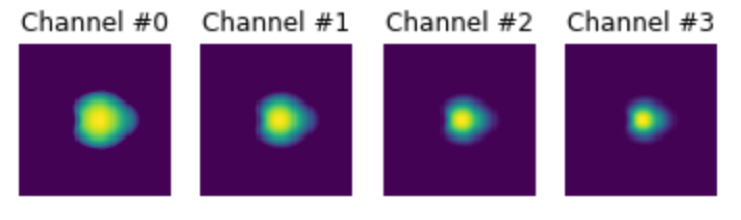

# The JAG inertial confinement fusion simulation dataset for multi-modal scientific deep learning.
This code contains pre-trained machine learning models, architectures and implementations for building surrogate models in scientific machine learning (SciML). SciML is a growing area, with a lot of unique challenges and problems. A lot of them are outlined in the Department of Energy's recent report on "Basic Research Needs for Scientific Machine Learning " [[pdf]](https://www.osti.gov/servlets/purl/1478744).

### Dataset from JAG Simulator for ICF

The JAG model has been designed to give a rapid description of the observables from ICF experiments, which are all generated very late in the implosion. In this way the very complex and computationally expensive transport models needed to describe the capsule drive can be avoided, allowing a single solution in 't' seconds. The trade-off is that JAG inputs do not relate to actual experimental observables, rather the state of the implosion once the laser drive has switched off. At that point, an analytic description of the spatial profile inside the hotspot can be found [1,2], leaving only a set of coupled ODEs describing the temporal energy balance inside the entire problem which can be solved easily [3]. The various terms in the energy balance equation relate to different physics processes (radiation, electron conduction, heating by alpha particles, etc), making JAG useful for investigating the role of various potentially uncertain physics models. Combined with a thin-shell model describing the 3D hydrodynamic evolution of the hotspot [4], JAG has a detailed description of the spatial and temporal evolution of all thermodynamic variables which can be post-process to predict a full range of experimental observables

* Betti et al., Physics of Plasmas 9, 2277 (2002)
* Springer et al. EPJ Web. Conferences 59:04001 (2013)
* Betti et al. Physical Review Letters 114:255003 (2015)
* Ott etc al. Physical Review letters 29:1429 (1995)

### Dependencies
This package was built and tested using `Tensorflow 1.8.0`. It also depends on standard Python packages such as `NumPy`, `Matplotlib` for basic data loading and plotting utilities.
### Pre-trained weights
Checkpoints for the models are available [[here]](https://drive.google.com/drive/u/0/folders/1jgDegfXqNFJjm_jQfnqzjcDQ9yNNQ2Pq).
### Description
A dataset is provided to test/train the models. This is a tarball inside 'data/', which contains .npy files for 10K images, scalars, and the coresponding input parameters. The size of the dataset provided (in 'data/') are as follows:
```
Input: (9984, 5), Output/Scalars: (9984, 15), Output/Images: (9984, 16384). Images are interpreted as (-1,64,64,4); i.e., 4 channels of 64x64 images.
```
As an example:
Here are input parameter for a single run (sample `0` in the dataset)
```sh
Input:
[-0.07920084,  0.70821885,  0.377287  ,  0.12390906,  0.22148967]

Output/Scalars:
[0.36831434, 0.36175176, 0.35908509, 0.38851718, 0.45318199,
0.17283457, 0.16303126, 0.36568428, 0.17283457, 0.03728897,
0.03728897, 0.12553939, 0.35908509, 0.17283457, 0.16303126,
0.35908509, 0.34737663, 0.16303126, 0.36175176, 0.45389942,
0.37021051, 0.22734619]

```
##### Output/Images:




Jupyter Notebook
Along with the dataset, we also provide a Python Jupyter Notebook, that is a self-contained script to load, process, and test the dataset described above. In particular, we include a Neural Network designed to act as a surrogate for the JAG 1D Simulator. The neural network is implemented in Tensorflow.

The provided notebook allows a user to load the dataset, load the neural network and train it such that given just the 5 input parameters, it predicts the scalars and images accurately. This can be done directly in the notebook, without any additional modifications. During training, intermediate predictions are also saved to disk (as specified by the user). We hope this serves as a starting point to build, test and play with the ICF-JAG simulation dataset. 

**More Information on Cycle Training:** I gave a talk recently outlining some of the methods used here, and their benefits in surrogate modeling. Slides can be found [[here]](https://drive.google.com/file/d/1aUI0nMF_DQda9a1dE8FA_ZSqwcR4zLCQ/view)

### Related Publications Using this Dataset
* Anirudh, R., et al. Improved surrogates in inertial confinement fusion with manifold and cycle consistencies, in Proc. of National Academy of Sciences (PNAS), April 2020. [[Paper]](https://www.pnas.org/content/early/2020/04/17/1916634117). 
* Anirudh, R., et al. Exploring Generative Physics Models with Scientific Priors in Inertial Confinement Fusion, to appear in [ML4PhysicalSciences](https://ml4physicalsciences.github.io/) workshop at NeurIPS 2019. [[paper]](https://arxiv.org/abs/1910.01666)
* Jacobs, S., et al. Parallelizing Training of Deep Generative Models on Massive Scientific Datasets, to appear in IEEE CLUSTER, 2019. [[paper]](https://arxiv.org/abs/1910.02270)
* Liu, S., et al. Scalable Topological Data Analysis and Visualization for Evaluating Data-Driven Models in Scientific Applications, in IEEE transactions on visualization and computer graphics (2019). [[paper]](https://arxiv.org/abs/1907.08325)


### Dataset Citation
If you use this dataset, please consider citing it as follows: 

```
@misc{JAG_LLNL,
	title = {The JAG inertial confinement fusion simulation dataset for multi-modal scientific deep learning.},
	author = {Gaffney, Jim A. and Anirudh, Rushil and Bremer, Peer-Timo and Hammer, Jim and Hysom, David and Jacobs, Sam A. and Peterson, J. Luc and Robinson, Peter and Spears, 	Brian K. and Springer, Paul T. and Thiagarajan, Jayaraman J. and Van Essen, Brian and Yeom, Jae-Seung},
	url = {https://library.ucsd.edu/dc/object/bb5534097t},
	howpublished = {In Lawrence Livermore National Laboratory (LLNL) Open Data Initiative. UC San Diego Library Digital Collections.},
	doi = {https://doi.org/10.6075/J0RV0M27},
	year = {2020},
	month = {3}
}
```
### Software Citation
If you use this code, please consider citing our paper as follows: 

```
@article {Anirudh9741,
	author = {Anirudh, Rushil and Thiagarajan, Jayaraman J. and Bremer, Peer-Timo and Spears, Brian K.},
	title = {Improved surrogates in inertial confinement fusion with manifold and cycle consistencies},
	volume = {117},
	number = {18},
	pages = {9741--9746},
	year = {2020},
	doi = {10.1073/pnas.1916634117},
	publisher = {National Academy of Sciences},
	issn = {0027-8424},
	URL = {https://www.pnas.org/content/117/18/9741},
	eprint = {https://www.pnas.org/content/117/18/9741.full.pdf},
	journal = {Proceedings of the National Academy of Sciences}
}

```
### License
This code is distributed under the terms of the MIT license. All new contributions must be made under this license.
LLNL-CODE-772361
SPDX-License-Identifier: MIT
